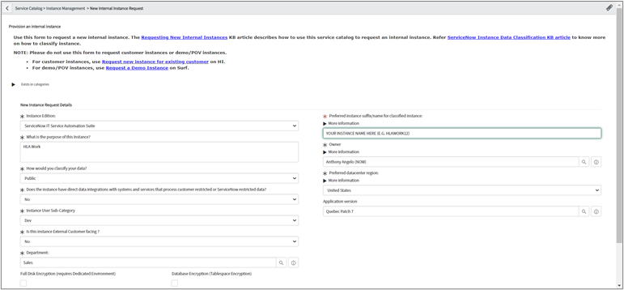
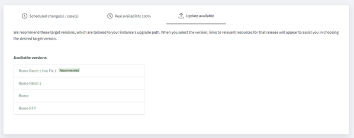

# Introduction

This document provides prescriptive guidance for deploying the HLA Workshop

# Prerequisites

Following is a list of prerequisite tools and accesses needed to perform a full HLA Workshop installation.This document provides prescriptive guidance for using installing the HLA Workshop:

* Access to an AWS Account with full admin privileges
* AWS CLI
* Bash Terminal Access (e.g., WSL for Windows, MacOS Terminal or another Linux)
* Terraform (e.g., Terraform v0.12.31)
* Ansible (e.g., v4.5.0)

# Deploy your NOW Instance

## Request a new NOW Instance

1. Navigate to [NOW HI](https://support.servicenow.com/now)
2. Search for "new internal instance request"
3. Request a new instance as follows, using the latest available application version:

## Upgrade your NOW Instance to latest Rome version

1. Navigate to [NOW HI](https://support.servicenow.com/now)
2. Select your Instance from the Instances Dashboard
3. Upgrade your instance to latest Rome version & patch level as follows:

## Install the required ITOM plugins for the Workshop

1. Login to your NOW Instance as an Administrator
1. Navigate to the **System Definition > Plugins** and install the following plugins:

    |  Plugin Name  |  Plugin ID | Notes |
    | ------------- | ---------- | ----- |
    | Agent Client Collector Monitoring | com.snc.sa.metric | 10 Minutes to install |
    | Service Mapping | com.snc.service-mapping | 20 Minutes to install |

## Install the HLA stack for your NOW Instance

1. Follow the [HLA Installation Guide](https://servicenow.sharepoint.com/:w:/s/itxamssc/EZUQY9F095VEmHuA0A4Od2cBEkjRbiVo8oWMLARC5HfjVg?e=iGEcKR) for the latest installation steps

    > NOTE: Please read and follow all the steps carefully as instructed in the "HLA Installation Guide" document as it us updated frequently by the HLA Development Team